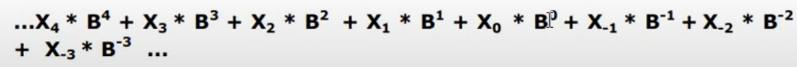

<!-- DRIVE -->
https://drive.google.com/drive/folders/1Ch_SanU-f4Yzugo-z2v0gY4IzaHBRNRG

<!-- 1RA CLASE -->
Sistemas de númeración. Veremos los distintos tipos de númeración (decimal, binario, hexadecimal, octal) y las conversiones de un sistema a otro. Además veremos el teorema fundamental de la numeración (cuando y como aplicarlo). Cada sistema tiene una base, esta base es la cantidad de números que posee el sistema. Por ej, el sistema binario solo usa dos números 1 y 2, entonces su base es 2. El decimal usa 10, de 0 a 9, su base es 10. El hexadecimal usa 16 carácteres por lo que su base es 16.  

<!-- Sistemas de númeración -->
Son un conjunto de simbolos y reglas que se utilizan para la representación de datos númericos o cantidades.

Número con su base (el (10 va pequeño por debajo, como la potencia pero en la parte inferior)) :
1936(10                                                                                                     )
Este número esta en el sistema decimal ya que tiene base 10.

1. <!-- SISTEMA DECIMAL  -->
Es un sistema posicional que usa los primeros 10 carácteres (del 0 al 9)
<!-- Como aplicar el teorema fundamental de la numeración cuando queramos hacer la conversión de un numero en x base a base 10. -->
<!-- (En la guía hay muchos ejs de este teorema) 
Ejemplo aplicandolo en un número con base 10: -->
23,1416(10 =                        )
<!-- Habiamos dicho que el sistema decimal es un sistema posicional, es decir sus digitos tienen una posición. Estas posiciones las identificamos referenciandonos con la coma, los números a su derecha, es decir los decimales, son negativos, y los números de su izquierda son positivos. El número antes de la coma vale 0 y el número después de la coma vale -1. -->
<!-- En este caso las posiciones son:  -->
2 = 1
3 = 0
,
1 = -1
4 = -2
1 = -3
6 = -4
<!-- Ahora con los números, sus posiciones y la base del número podemos llevar a cabo el teorema, que consiste en sumar los productos. 
Pero, ¿los productos de que? De una multiplicación que se hará por cada número existente. 
Esta será: el digito * su base elevado a la posición. Las multiplicaciones pueden ser desde atras o desde adelante.--> Teorema: digito * base a la posición
6 * 10 a la -4 + 
1 * 10 a la -3 + 
4 * 10 a la -2 + 
1 * 10 a la -1 + 
3 * 10 a la 0 + 
2 * 10 a la 1 == resultado.

<!-- A esto se le llama aplicarle el teorema fundamental a un número.. Pero ahora queremos ver la definición expresada correctamente, la siguiente: -->

<!--
Que es similar pero remplazando los digitos con una X acompañada del número de su posición en la esquina inferior derecha, y reemplazando también el número de la base por una B con el número de la posición como potencia 
-->
X(3 * B(3  +                                                )) 
<!-- Y sigue con el resto de multiplicaciones según la cantidad de dígitos. Será una multiplicación por cada dígito. Recordemos, se multiplica a el por su base elevada en por la posición en la que se encuentre. Y recordemos también que las posiciones se identifican desde la coma, los números de su izquierda son números + comenzando desde 0, y hacia su derecha son números negativos comenzando desde -1.  -->

Ahora daré un número al azar y lo escribiré en ambas fórmulas.
10,516 a la 10

<!-- Aplicación -->
1 * 10 a la 1
0 * 10 a la 0
5 * 10 a la -1
1 * 10 a la -2
6 * 10 a la -3

<!-- Definición -->
1(1 * 10(1  +  0(0 * 10(0  +  5(-1 * 10(-1  +  1(-2 * 10(-2  +  6(-3 * 10(-3                         )))))))))) 

CONVERSIÓN DE DECIMAL A BINARIO 
<!-- Hay 3 casos. Cuando el número es entero, cuando es decimal sin parte entera (menor a 1), cuando tiene ambas entero y decimales (la más díficil) -->

if (Número entero). Divisiones sucesivas
<!-- Usaremos el 19. Debemos usar el método de las divisiones sucesivas. Esto consiste en dividir al número sucesivamente por la base a la que lo queremos llevar (en este caso la base 2 del sistema binario) debemos continuar dividiendo los cocientes de la división hasta que encontrar el cociente 0, sin importar el resto final. Ejemplo:  -->

19 / 2    
1   9 / 2
    1   4 / 2
        0   2 / 2
            0   1 / 2
                1   0
<!-- Restos: 1 1 0 0 1 (en el orden obtenido, se deberán invertir para formar el número convertido) -->
<!--Los restos obtenidos por las divisiónes del número principal y los cocientes formarán al número convertido en el sistema deseado. 
Los restos se deben ordenar del último hacia el primero, en este caso el 19 en decimal convertido a binario nos dió 10011(2  -->

else if(Número decimal) (menor a 1). Múltiplicaciones sucesivas. 
0,75
<!-- El metodo a usar consiste en multiplicar por la base a la que lo queremos llevar (2 en esta caso) al número y luego a los decimales del resultado. Similar al metodo anterior pero en vez de dividiendo cocientes multiplicando decimales. 
Se comienza operando al número inicial y luego se continúa multiplicando a los décimales del resultado hasta obtener un número entero como resultado, sin decimales. Los números enteros que se obtendrán en las multiplicaciones serán los números que formarán al número de la conversión, y estarán ubicados en la posición negativas, es decir las decimales. El primer número entero se ubicará en la posición -1, el siguiente en la posición -2. Resolvemos la conversión de este número para que se comprenda. -->

0,75 * 2 = 1,50 <!--Como dijimos, el número entero es el primer número decimal de la conversión final que se ubicará en P-1 -->
0,50 * 2 = 1    <!--Se frenan las múltiplicaciones sucesivas ya que no tenemos más decimales que multiplicar.-->
<!-- Entonces el número 0,75 en decimal convertido a binario es:  -->
0,11 (2                                     )
<!-- Recordemos que esta elevado a la base del sistema al que lo queremos convertir (binario en este caso) -->
0,75(2 == 0,11(2                                                    ))

else if(Número entero && número decimal)
13,25
<!-- Ahora debemos usar ambos metodos. El de divisiones para el número entero y las multiplicaciones para los decimales. -->
<!-- Metodo de divisiones sucesivas para convertir al 13 en sistema binario -->
13 / 2
1    6 / 2
     0   3 / 2
         1   1 / 2
             1   0
<!-- Entonces el número 13(10 en sistema binario es : -->
1101(2                                                              )
<!-- Recordar invertir los restos obtenidos, desde el último hasta el primero. -->

<!-- Metodo de multiplicaciones sucesivas para convertir al 0,25 en sistema binario. -->
0, 25 * 2 = 0,50 
0, 50 * 2 = 1.
<!-- Números obtenidos en 0 (p-1) y 1 (p-2) -->
<!-- Entonces el número 0,25(10 en sistema binario es:  -->
0,01(2                                                              )

<!-- Entonces ya con ambas conversiones a binario (la de los números enteros y la de los decimales) debemos unirlas para obtener el resultado completo) Entonces 13,25 en sistema decimal equivale en sistema binario al número:  -->
1101,01 en base 2 (sistema binario).

<!-- FIN SISTEMA DECIMAL Y SUS CONVERSIONES A BINARIO.-->

 

2. <!--SISTEMA BINARIO-->
Si un número está en sistema binario su base es 2. Este sistema solo utiliza los números 0 y 1. Es el sistema que usa la pc, el compilador traduce nuestro código a binario para que ella lo entienda.
Si hiciesemos una conversión de binario a decimal estariamos pasando un número de base 2 a base 10.
Un número binario debe tener como dígitos a 1 y/o a 0 y tener de base 2.

Conversión de un número binario a decimal. Aplicamos el teorema fundamental. 
<!-- Recordemos, este teorema se usa en conversión a DECIMAL, osea base 10. Por eso lo usamos en este caso. -->
<!-- Para realizar la conversión el primer paso es obtener las posiciones de los dígitos, usaremos el número 1101(2                      )
Este número no tiene coma eso significa que estará al final, no tiene decimales. Entonces la posición del último digito 1 es 0, y suma 1 hacia su izquierda. Entonces las multiplicaciones a las que debemos sumar sus productos quedarían así:  -->

<!-- Cuentas -->
1 * 2 a la 0
0 * 2 a la 1 
1 * 2 a la 2
1 * 2 a la 3

<!-- Formula -->
1(0 * 2(0 + 0(1 * 2(1 + 1(2 * 2(2 + 1(3 * 2(3                                       )))))))) 
    1     +     0      +     4      +      8    = 13
                    
<!-- Este resultado nos informa que el número 1101 en sistema binario equivale al número 10 en sistema decimal -->
1101(2 === 13(10                                                                                                 ))

<!-- FIN DEL SISTEMA BINARIO Y SU CONVERSIÓN A DECIMAL. -->

3. SISTEMA HEXADECIMAL
<!-- 
Este sistema tiene 16 carácteres por lo tanto su base es 16, utiliza los 10 dígitos del sistema decimal y las primeras 6 letras del abecedario, por lo tanto maneja carácteres alfanúmericos. Los 6 carácteres alfabéticos tienen un valor númerico, ellos son:
A == 10
B == 11
C == 12 
D == 13
E == 14
F == 15 
Es decir que se le agregan 5 números que pueden ser representados por letras. La A repite a un número ya existente en el sistema, el 10.
-->

CONVERSIONES
 
1. Hexadecimal a Decimal. 
2E7(16<!-- Debemos utilizar el teorema fundamental ya que queremos obtener un número decimal.--> )
7 * 16 a la 0 + 14 * 16 a la 1 + 2 * 16 a la 2
7 + 224 + 512 = 
743 <!--Resultado final-->

Entonces 2E7(16 == 743(10 (hexadecimal a decimal) ))

2. Conversión de Decimal a Hexadecimal. 
<!-- Ya que no debemos usar el teorema por no buscar base 10 si no 16, debemos usar unos de los metodos de multiplicación o división, según los números que operemos (positivos o negativos)
Convertiremos el decimal 1000(10  a hexadecimal. Ya que es un número entero debemos realizar divisiones sucesivas.-->
1000(10                                                 )

1000 / 16
8      62 / 16
       14   3 / 16
            3   0

<!-- Recordemos, al llegar al cociente 0 se acaba la división sucesiva y se debe formar el número por los restos encontrados desde el último hasta el primero. RECORDEMOS desde el 11 los números deben ser representados por letras en el sistema hexadecimal, por lo tanto nuestro 14 será una E, la conversión quedará :  -->
1000(10 == 3E8(16                                                                                   ))

3. Conversión de hexadecimal a binario.
<!-- Para realizar esta conversión se reemplaza cada dígito hexadecimal por su representación binaria con 4 dígitos.
Tabla que muestra las equivalencias:  -->
Hexa/Binarios
0  == 0000
1  == 0001
2  == 0010
3  == 0011 
4  == 0100
5  == 0101
6  == 0110
7  == 0111
8  == 1000
9  == 1001
A  == 1010
B  == 1011
C  == 1100
D  == 1101
E  == 1110
F  == 1111

<!-- Entonces si tenemos el número: A4,B3(16, convertir a binario (2. -->
10100100,10110011(2                                                                         )

3. Conversión de binario a hexadecimal.
10011,1(2                               )
<!-- Ya que las equivalencias requieren de 4 números binarios, deberemos rellenar 2 familias de números que quedan aislados, el número 1 en los decimales y el primer número 1 de los enteros. En los decimales rellenaremos con 3 ceros. Y al primer número le agregaremos adelante 3 ceros también. ¿Por qué es el 1 de adelante y no el de átras el que queda aislado? Porque los grupos se forman desde la coma hacia atras o hacia adelante, depende si estamos uniendo decimales o enteros. Por eso la única familia que se encontró son los números en las posiciones 0, 1, 2  y 3. -->
00010011,1000(2                         )
<!-- Ya con los huecos rellenados podemos realizar la conversión con la tabla. -->
13,8(16 <!--Recordemos que hexadecimal reemplaza por letras a partir del 10 por lo que: --> )
<!-- En este caso no podemos reemplazar el 13 por una D ya que la D tiene su valor propio en la tabla. -->

<!-- FIN SISTEMA HEXADECIMAL -->

4. SISTEMA OCTAL
<!-- El cambio de octal a binario y viceversa se puede hacer fácilmente desde una tabla. -->
Octal/Binario
0 == 000
1 == 001
2 == 010
3 == 011
4 == 100
5 == 101
6 == 110
7 == 111
<!-- Número binario a convertir 1100100,00000000101. Debemos separarlo en grupos de 3 ya que esa es la cantidad de carácteres que tienen los binarios en la tabla de conversión, recordar que los números se obtienen desde la coma hacia la izq o der, depende el caso. Cuando resten números y no se formen las familias (esto sucederá cuando la cantidad de números decimales o enteros no es múltiplo de 3) debemos rellenar con 0, los suficientes para formar el grupo de 3.-->
1100100,00000000101 
001100100,000000001010(2 == 144,0012(8                                  ))
<!-- Rellenamos con 2 ceros al comienzo y un 0 al final para formar los grupos restantes. -->

<!-- EJERCICIOS FINALES -->
Convertir a número decimal:
<!-- Como vimos, debemos usar el teorema que consiste en sumar los productos de los dígitos por la base elevado a la posición del dígito. -->
1. 12,3 (4      )
2. B9, 01(16    )
3. 371,4(8      )
4. 10100,001(2  )
5. 6,125(7      )
6. 1111,11(2    )
7. D,0C(16      )
8. 44,2(8       )
9. 64,1(9       )

<!-- Resoluciones -->
1. 12,3(4 == 
1 * 4(1 + 2 * 4(0 + 3 * 4(-1 ==                                   ))))
4 + 2 + 3 * 0,25 ==
4 + 2 + 0,75 ==
6,75

Entonces 12,3(4 == 6,75(10                                        ))
<!-- Cuando una potencia es negativa debemos invertir la fracción, es decir en este caso ese 4 representa a 4 enteros es decir 4/1 al invertirlo obtenemos 1/4 en vez de ser 4 partes entera es una cuarta parte. Inversión de valor. De positivo a negativo pero es la misma cantidad solo en el otro caso ahora entre positivo y negativo. 
En el ejemplo anterior nos referimos a la inversión de la base elevada a -1, en el caso de la multiplicación del dígito decimal, que se encuentra en esa posición (-1). Por eso se convierte 4(-1 en 0,25 o un cuarto en fracción.  -->

3. 371,4(8 ==                   )
3 * 8(2 + 7 * 8(1 + 1 * 8(0 + 4 * 8(-1) ==                  )))
192 + 56 + 1 + 4 * 0.125
192 + 56 + 1 + 0.5 ==
    249.5(10                                                )
<!-- Entonces 371,4(8 equivale a 249,5(10 -->

<!-- FIN DE LA PRIMER CLASE. -->